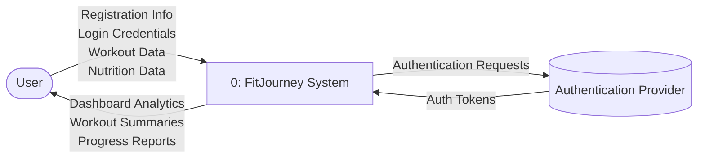
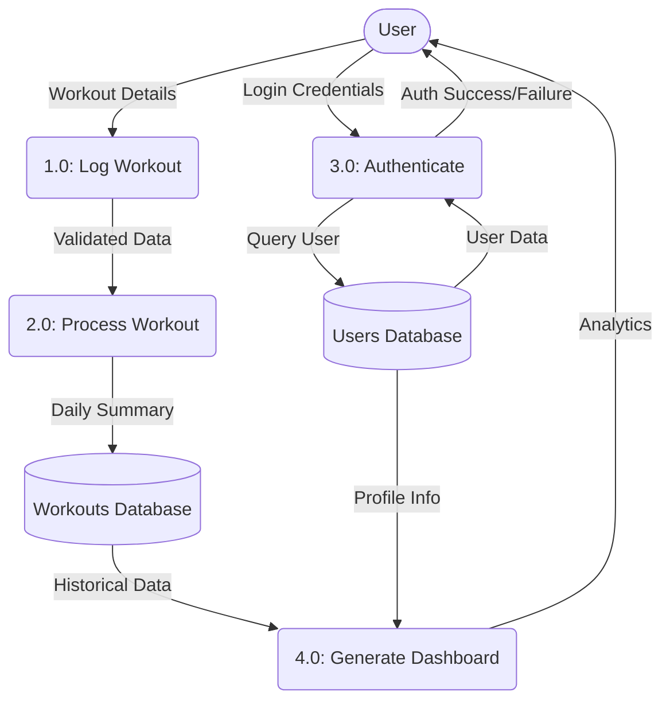

# CW3 — Requirements Document

## 1. Context Diagram (Level 0 DFD)



## 2. Level 1 Data Flow Diagram (DFD)



## 3. Use Case Diagram

```mermaid
usecaseDiagram
    actor User as User
    actor Admin as System Administrator
    
    package FitJourney_System {
        usecase "Login" as UC1
        usecase "Register" as UC2
        usecase "Edit Profile" as UC3
        usecase "Log Workout" as UC4
        usecase "Log Nutrition" as UC5
        usecase "View Dashboard" as UC6
        usecase "Manage Users" as UC7
        usecase "Search Food DB" as UC8
        
        %% Include and extend examples
        UC2 ..> UC1 : <<include>>
        UC4 ..> UC1 : <<include>>
        UC5 ..> UC1 : <<include>>
        UC6 ..> UC1 : <<include>>
        
        UC5 <.. UC8 : <<extend>>
    }

    User --> UC1
    User --> UC2
    User --> UC3
    User --> UC4
    User --> UC5
    User --> UC6
    
    Admin --> UC1
    Admin --> UC7
```

## 4. Use Case Narratives

### UC-01: Log Workout
**Summary:** A user logs a strength training session into the application, including exercises, sets, reps, and weights.
**Primary Actor:** User
**Preconditions:** 
1. The user must be authenticated and logged into the application.
2. The user is on the "Add Activity" screen.
**Main Sequence:**
1. User selects "Strength Training" from the activity menu.
2. System displays a form to input exercise details.
3. User selects the exercise name from a dropdown and inputs sets, reps, and weight.
4. User clicks "Save Workout".
5. System validates that the input values are positive integers.
6. System logs the workout to the database and recalculates the user's weekly volume.
7. System displays a success message: "Workout saved successfully."
8. User is returned to their dashboard.

**Alternative Sequence A — Invalid Input (Step 5):**
5a. User inputs a negative number for "Weight".
5b. System highlights the field in red and displays an error message "Weight must be a positive number". The form cannot submit until corrected.

**Alternative Sequence B — Session Timeout (Step 6):**
6a. The user's authentication token has expired since they last interacted.
6b. System aborts the save and redirects the user to the Login screen with message "Session expired. Please log in again."

**Postcondition:** Workout details are permanently stored and visible on the dashboard activity feed.

---

### UC-02: User Registration
**Summary:** A new user signs up for the application by creating a profile.
**Primary Actor:** User
**Preconditions:** The user is not currently logged into an account.
**Main Sequence:**
1. User navigates to the registration page.
2. System displays the registration form.
3. User inputs their email, desired password, and basic profile info (age, height, weight).
4. User submits the form.
5. System checks the database to ensure the email address is not already registered.
6. System hashes the password and creates a new User record.
7. System successfully logs the user in (an `<<include>>` behavior).
8. System directs the user to the personalized onboarding screen.

**Alternative Sequence A — Email already exists (Step 5):**
5a. System detects that an account with that email already exists.
5b. System aborts registration and shows error: "An account with this email already exists. Would you like to log in instead?"

**Alternative Sequence B — Weak password (Step 4):**
4a. User submits a password less than 8 characters.
4b. System triggers a client-side validation error before attempting database creation, highlighting the password field.

**Postcondition:** A new secure user record is generated in the system.

---

### UC-03: View Dashboard
**Summary:** A returning user checks their recent activity and weight progression chart.
**Primary Actor:** User
**Preconditions:** User is logged in.
**Main Sequence:**
1. User clicks on "Dashboard" in the main navigation.
2. System requests the user's recent workout logs and historical weight data from the database.
3. System aggregates the data and dynamically renders a line chart for weight progression.
4. System displays the 5 most recent activities in the 'Recent Feed' component.
5. User views the presented analytics.

**Alternative Sequence A — No Data (Step 3):**
3a. System detects the user has not logged any workouts or weight changes yet.
3b. System renders a placeholder empty state: "Welcome to FitJourney! Log your first workout to see analytics here."

**Alternative Sequence B — Database Error (Step 2):**
2a. Database connection times out.
2b. System returns a generic error to the frontend: "Unable to load dashboard data. Please refresh the page."

**Postcondition:** The user has viewed current, accurate insights into their fitness progression.
