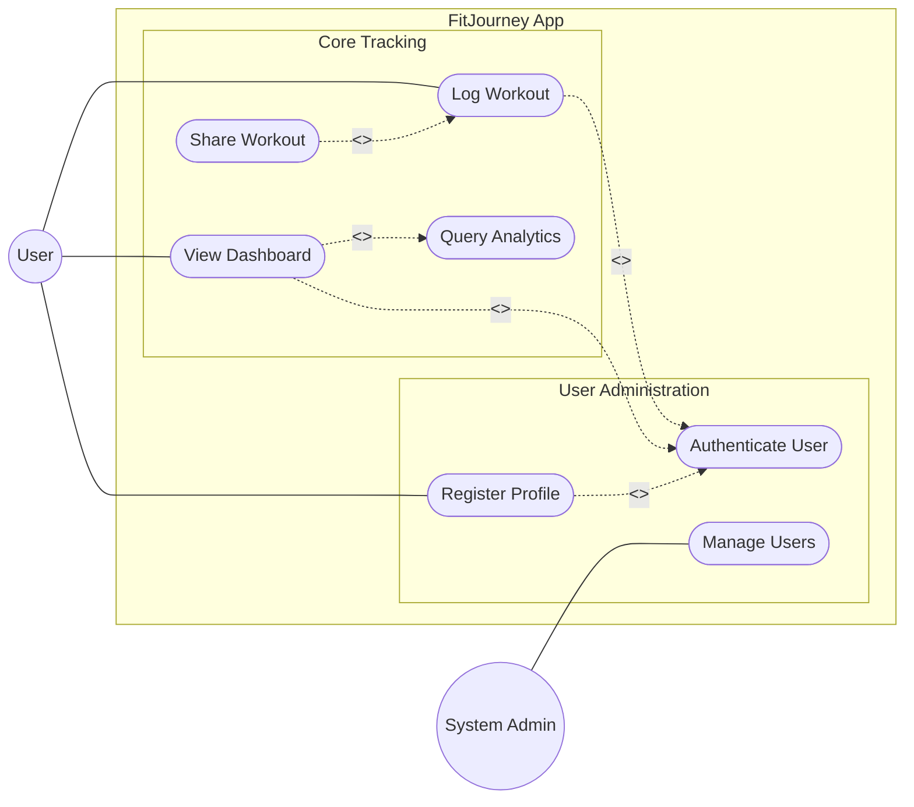
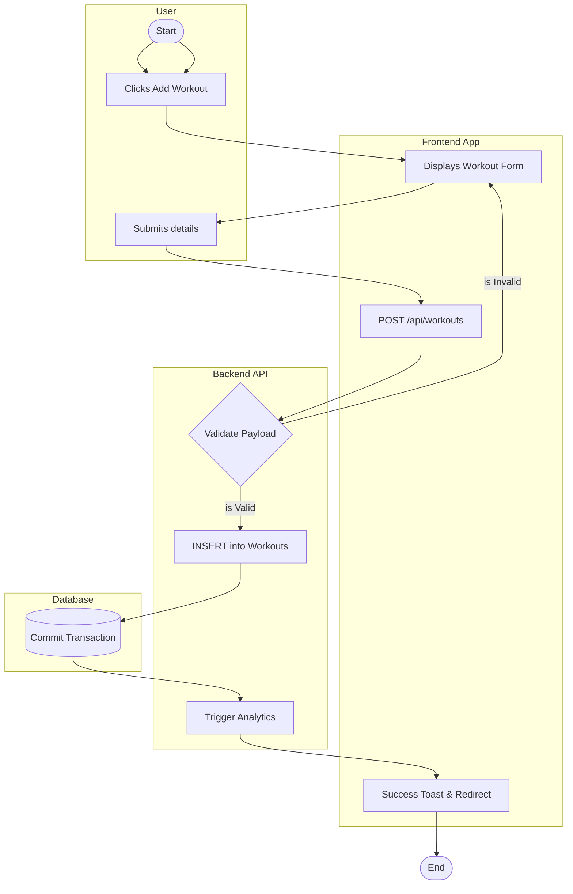
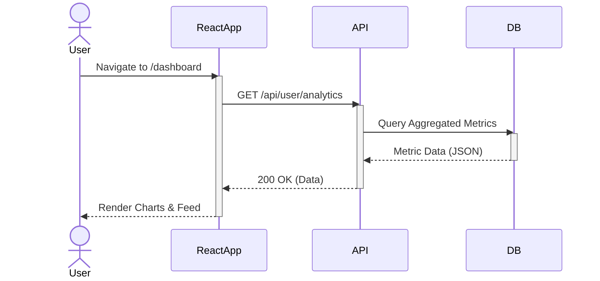
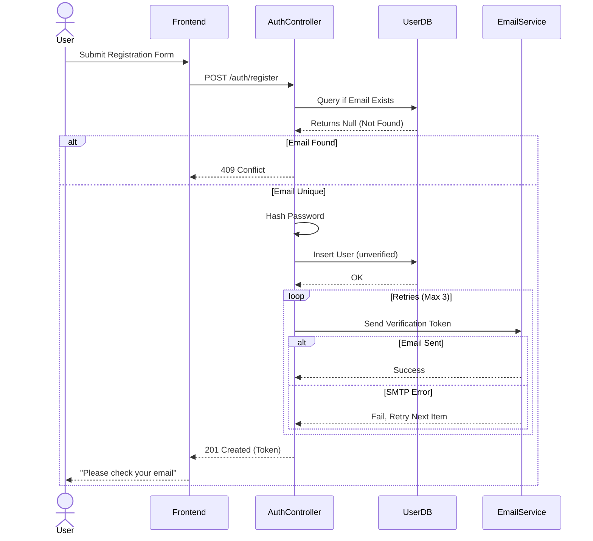

# CW4 — UML Behavioural Suite

## 1. Refined Use Case Diagram

### Changes from CW3
Based on peer feedback and a more robust architectural review, the following refinements were made to the Use Case diagram:
1. **System Boundary**: Formally defined the `FitJourney_App` boundary to exclude external actors.
2. **Modularization**: Grouped use cases into logical packages (`User Administration` and `Core Tracking`) to reflect the 3-tier architecture.
3. **Actor Precision**: Distinguished between the `User` and `SystemAdmin` roles more clearly, refining the associations to ensure Principle of Least Privilege.
4. **Relationship Cleanup**: Refined the `<<include>>` and `<<extend>>` relationships to avoid diagram congestion.



## 2. Activity Diagram: "Log New Workout"

A swimlane Activity Diagram illustrating the parallel interactions between the client UI, the backend server API, and the database.



## 3. Sequence Diagrams

### Simple Sequence: View Dashboard
Demonstrating a straightforward 3-object read interaction.



### Complex Sequence: Registration with Email Verification Loop
Demonstrating loops, conditions, and external services.



## 4. Communication Diagram

Derived from the "Simple Sequence: View Dashboard" diagram to emphasize the organizational relationships between objects rather than the strict chronological sequence.

**Text-Notation Model:**
```
  [User (Browser)] 
         │ 
         │ 1: navigateDashboard()
         │ 4: renderView()
         ▼ 
  [ReactApp (Frontend)] ─────────► [API (Backend Service)]
                          2: getAnalytics() │
                          3: returnJson()   │
                                            │ 2.1: queryMetrics()
                                            │ 2.2: returnData()
                                            ▼
                                   [DB (PostgreSQL)]
```

## 5. Diagram Rationale
We selected the **"Log Workout"** flow for the Activity Diagram because it is the core intellectual transform of the system (taking raw user data and making it persistent) and involves a clear decision fork (validation success vs. failure). We chose **Registration** for the complex Sequence Diagram because it demonstrates an external service interaction (EmailService) and a potential loop (retry logic for sending emails), which accurately reflects common enterprise application concerns.
