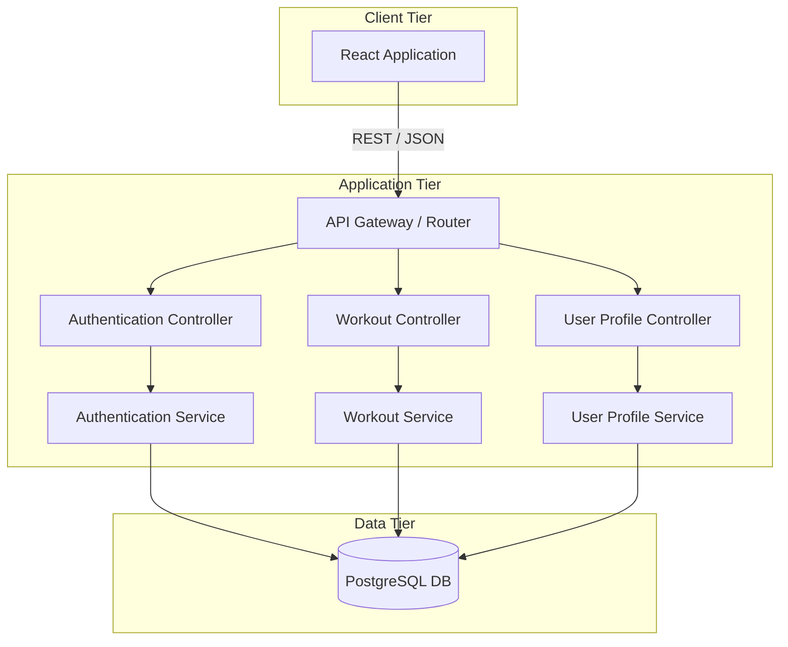
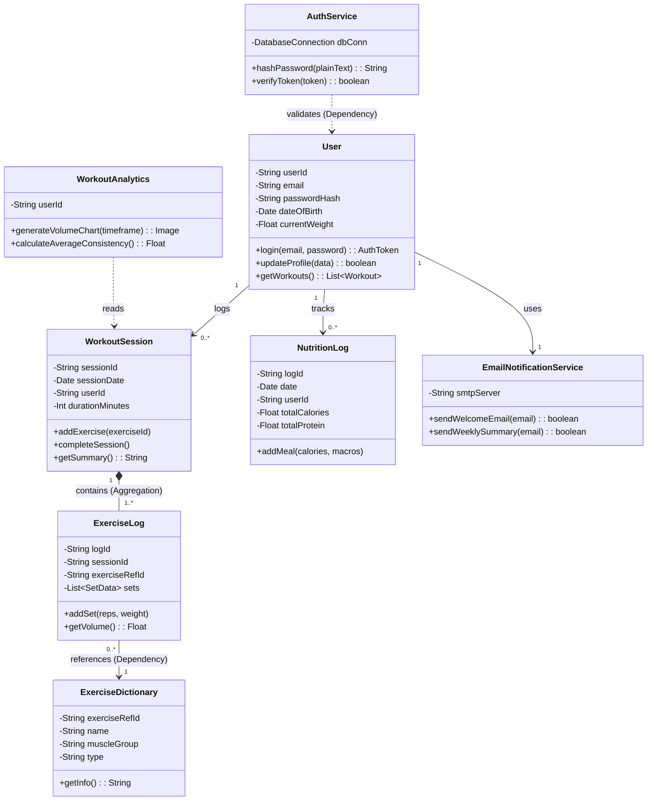
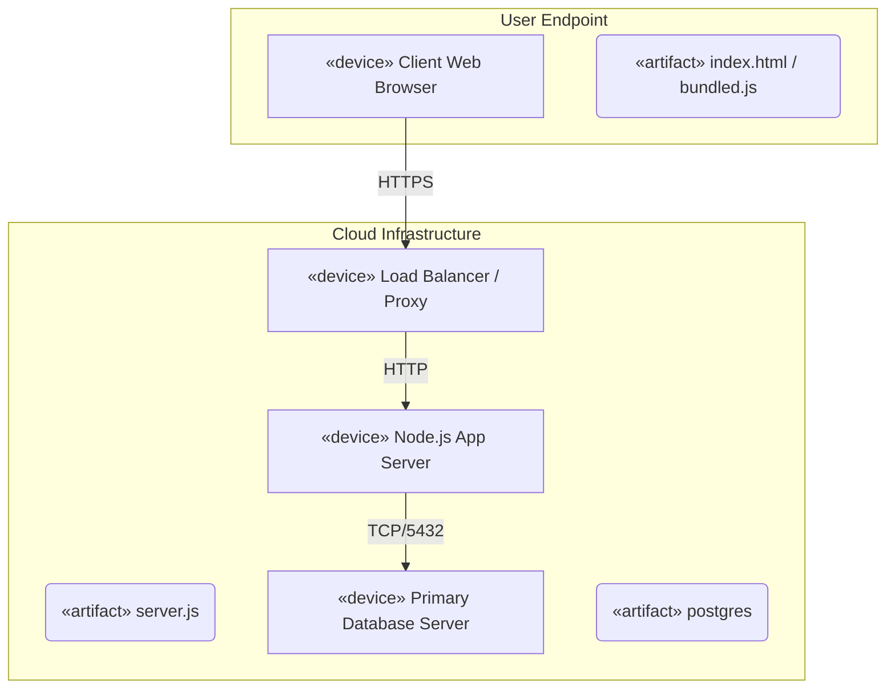

# CW5 — Design Document

## 1. Architectural Style Selection
**Chosen Style: Layered Architecture (3-tier) + MVC**
FitJourney uses a standard 3-tier Layered Architecture consisting of a Presentation Layer (React Web App), a Business Logic Layer (Node.js API), and a Data Layer (PostgreSQL). We chose this because the separation of concerns perfectly fits our domain: the UI can be updated independently of the backend algorithms, and database schemas can be altered without rewriting frontend logic. It is particularly noticeable and effective in standard analytical/CRUD web applications.

**Rejected Alternative: Event Bus Pattern**
We rejected an Event Bus (Event-Driven) architecture. We don't have multiple independent, disparate modules that need to react asynchronously to random system events (like a high-frequency trading platform would). A synchronous RESTful call-and-return approach inside our Layered Architecture was far simpler and more appropriate for a straightforward fitness tracking app.

## 2. Component Diagram

## 3. Class Diagram 

This diagram contains at least 8 classes covering users, workouts, exercises, and authentication.

## 4. Deployment Diagram

A structural visualization showing hardware and runtime artifact placement.

## 5. Wireframe Appendix

To maintain pure markdown compatibility while satisfying the requirement for 4 annotated screens with flow, we represent the wireframes textually:

**Screen 1: Landing & Login Page**
* *Top Bar:* FitJourney Logo (left), "Sign Up" / "Login" links (right).
* *Center Content:* "Welcome back." Email input box, Password input box (masked), "Submit" button.
* *Navigation Flow:* Clicking "Submit" checks credentials -> navigates to Screen 2.

**Screen 2: User Dashboard**
* *Sidebar:* Dashboard (active), Workouts, Profile.
* *Top Widget:* Line chart showing "Weight Progression over 30 days".
* *Bottom Widget:* "Recent Activity Feed" containing a list of the 5 most recent workouts logged.
* *Floating Action Button (Bottom Right):* "+" icon.
* *Navigation Flow:* Clicking "+" opens a modal leading to Screen 3.

**Screen 3: Add Workout Modal**
* *Header:* "Log New Session". Date picker default to today.
* *Body:* Dropdown "Select Exercise". Below it: dynamic rows for `Set # | Reps | Weight [ lbs ]`.
* *Footer:* "Add Set" (secondary button) and "Save Workout" (primary green button).
* *Navigation Flow:* Clicking "Save Workout" validates form -> closes modal -> Refreshes Screen 2 with new data.

**Screen 4: User Settings**
* *Header:* "Profile Settings".
* *Body:* Text fields for Height, Weight, Age, Target Goal.
* *Footer:* "Update Profile" button.
* *Navigation Flow:* Accessed from the Sidebar on Screen 2. Modifies User object globally.
