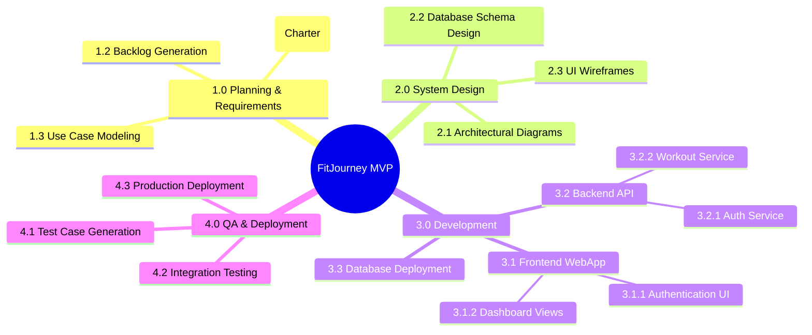
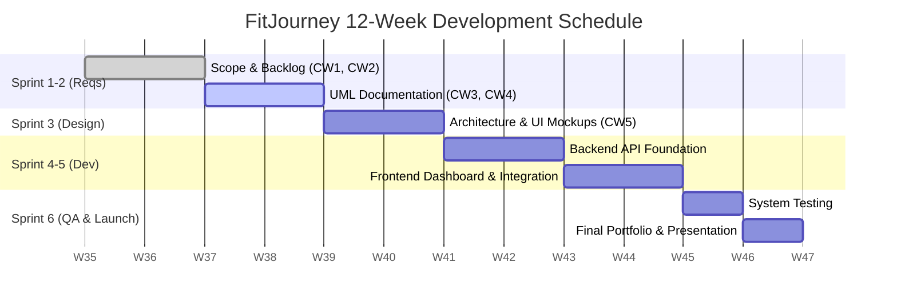

# CW6 — Project Management Plan

## 1. Work Breakdown Structure (WBS)
Decomposed to 3 levels, covering the primary software engineering lifecycle phases.

## 2. Gantt Chart
A 12-week development window showcasing standard sequential dependencies.

## 3. RACI Matrix
Roles: Project Manager (PM), Lead Developer (LD), Frontend Dev (FE), Backend Dev (BE).

| Activity / Task | PM | LD | FE | BE |
|-----------------|---|---|---|---|
| 1. Define Requirements | A | R | C | C |
| 2. Design System Architecture | C | R | I | I |
| 3. Develop API Endpoints | I | A | C | R |
| 4. Create UI Dashboards | I | A | R | C |
| 5. Quality Assurance Testing | R | A | C | C |
| 6. Final Deployment | A | R | C | C |

*(R = Responsible, A = Accountable, C = Consulted, I = Informed)*

## 4. Risk Register

| ID | Description | Likelihood | Impact | Score | Mitigation Strategy |
|----|-------------|------------|--------|-------|---------------------|
| R1 | Developer unfamiliarity with React framework | M | H | **MH** | Schedule paired programming in Weeks 3-4; locate boilerplate open-source templates to accelerate UI creation. |
| R2 | Scope Creep: Adding too many nutrition features | H | M | **HM** | Strictly adhere to the MoSCoW prioritization in CW2. Push "Could Have" items to v2.0 immediately. |
| R3 | Lack of actual test users to give feedback | L | H | **LH** | Recruit classmates from the SPM course early on to run beta testing in exchange for coffee. |
| R4 | Database schema doesn't fit the complex workout types | M | M | **MM** | Start with a NoSQL JSON structure to allow flexibility before standardizing an SQL schema later in the project. |
| R5 | API connection timeouts causing poor UX | L | M | **LM** | Ensure global loading spinners are implemented in the UI and a generic error boundary catches HTTP 500 errors gracefully. |

## 5. Effort Estimate (Use-Case Points)

**Parameters:**
* **Unadjusted Use Case Weight (UUCW):** 7 use cases identified in CW4. (4 simple @ 5 = 20; 3 average @ 10 = 30). Total UUCW = 50.
* **Unadjusted Actor Weight (UAW):** 2 Actors. (1 simple @ 1, 1 average @ 2). Total UAW = 3.
* **Unadjusted Use Case Points (UUCP) = 53**
* **Technical Complexity Factor (TCF):** Let's assume average complexity = 1.0.
* **Environmental Factor (EF):** Team has mixed experience = 1.1.
* **Adjusted UCP (AUCP) = 53 * 1.0 * 1.1 = ~58 UCP**

**Translation to schedule:**
At an industry standard of 20 person-hours per UCP:
`58 UCP * 20 hours = 1,160 person-hours.`
For our team of 3 students working ~15 hours a week total (5 hours each):
`1,160 / 15 = roughly 77 calendar weeks.`

*Note: Since an academic semester is only 12 weeks, this estimation objectively proves that we must heavily rely on pre-built frameworks, reduce the depth of our use cases, and stick strictly to the MVP scope to finish on time.*
