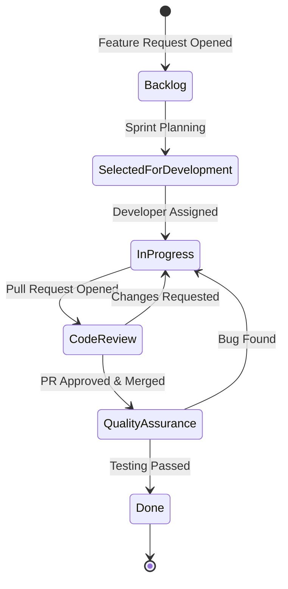
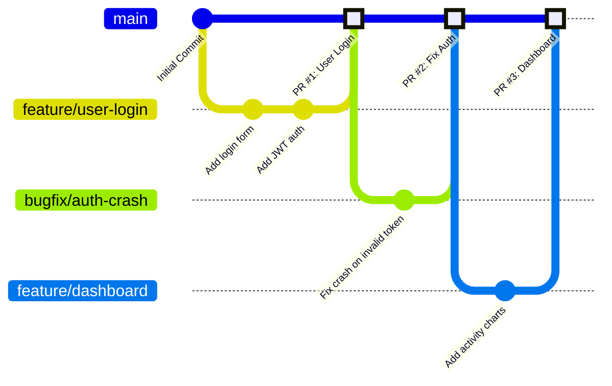
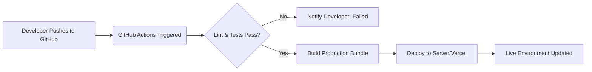

# Software Development Lifecycle (SDLC) & Agile Workflow

This document illustrates the Agile workflows and processes utilized by the FitJourney team to manage tickets, code, and deployment.

## 1. Issue Tracking Lifecycle (Kanban/Scrum Board)

How a feature moves from an idea to production.

## 2. Git Branching Strategy (GitHub Flow)

How code is integrated into the source repository.

## 3. CI/CD Pipeline Flow

How code reaches the server automatically.

