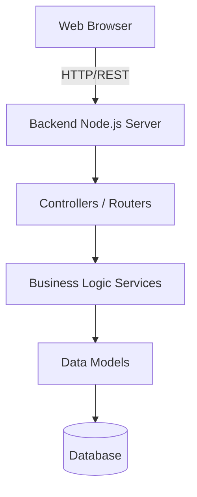

# System Architecture Overview

This document outlines the high-level architecture of the FitJourney application.

## 1. High-Level Architecture
FitJourney follows a classic Client-Server (Three-Tier) architecture.

1. **Presentation Tier (Frontend)**
   - Responsible for rendering the user interface and managing client-side state.
   - Communicates with the backend via RESTful APIs.
   - Built with modern JavaScript/TypeScript frameworks (e.g., React, Vue, or Angular).

2. **Application Tier (Backend)**
   - Responsible for business logic, processing requests, authentication, and communicating with the database.
   - Exposes a JSON-based REST API.
   - Built using Node.js/Express.

3. **Data Tier (Database)**
   - Responsible for persistent data storage (Users, Workouts, Nutrition Logs).
   - Typically MongoDB or PostgreSQL, depending on the configuration.

## 2. Component Diagram

## 3. Technology Stack Summary
* **Frontend:** HTML, CSS, JavaScript (Framework TBD)
* **Backend:** Node.js, Express.js
* **Database:** NoSQL/SQL (Depending on db implementation)
* **Deployment:** Local development environments for now (e.g., localhost:3000 / localhost:5000), eventual deployment to platforms like Heroku, Vercel, or AWS.

## 4. Git Version Control & Branching
- **`main`:** Contains production-ready code.
- **`develop`:** (Optional) Integration branch for features.
- **`feature/*`:** Branches where active development happens. Created from `main` or `develop` and merged via Pull Request.
