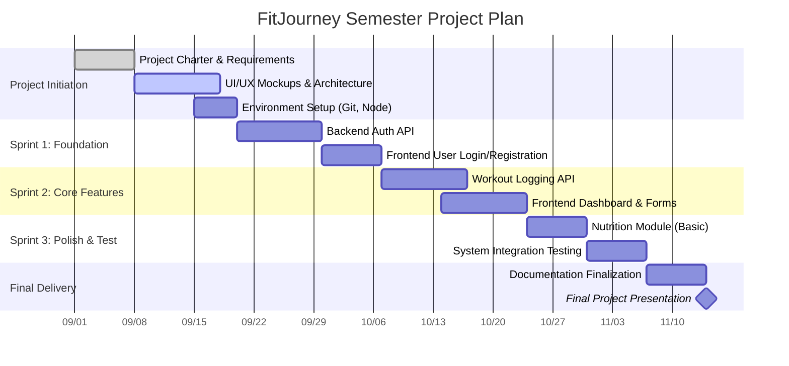

# Project Timeline (Gantt Chart)

This timeline represents the high-level schedule for the FitJourney MVP development across a typical 12-week academic semester.

```mermaid
gantt
    title FitJourney Semester Project Plan
    dateFormat  YYYY-MM-DD
    axisFormat  %m/%d

    section Project Initiation
    Project Charter & Requirements   :done,    init1, 2024-09-01, 7d
    UI/UX Mockups & Architecture     :active,  init2, 2024-09-08, 10d
    Environment Setup (Git, Node)    :         init3, 2024-09-15, 5d

    section Sprint 1: Foundation
    Backend Auth API                 :         s1_1,  2024-09-20, 10d
    Frontend User Login/Registration :         s1_2,  after s1_1, 7d

    section Sprint 2: Core Features
    Workout Logging API              :         s2_1,  2024-10-07, 10d
    Frontend Dashboard & Forms       :         s2_2,  2024-10-14, 10d

    section Sprint 3: Polish & Test
    Nutrition Module (Basic)         :         s3_1,  2024-10-24, 7d
    System Integration Testing       :         s3_2,  2024-10-31, 7d

    section Final Delivery
    Documentation Finalization       :         fd1,   2024-11-07, 7d
    Final Project Presentation       :milestone, fd2, 2024-11-14, 0d
```
