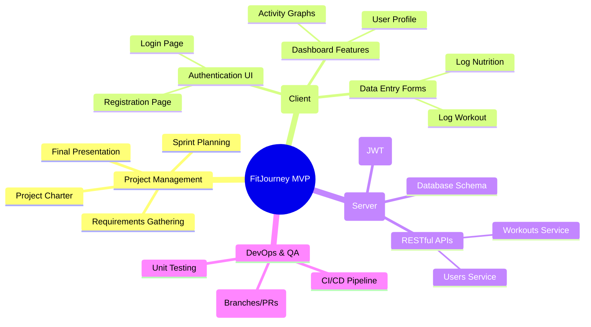

# Work Breakdown Structure (WBS)

A Work Breakdown Structure visually breaks down the FitJourney project into smaller, manageable components for the development team.

```mermaid
mindmap
  root((FitJourney MVP))
    Project Management
      Project Charter
      Requirements Gathering
      Sprint Planning
      Final Presentation
    Frontend (Client)
      Authentication UI
        Login Page
        Registration Page
      Dashboard Features
        Activity Graphs
        User Profile
      Data Entry Forms
        Log Workout
        Log Nutrition
    Backend (Server)
      RESTful APIs
        Users Service
        Workouts Service
      Database Schema
      Security & Auth (JWT)
    DevOps & QA
      GitHub Setup (Branches/PRs)
      CI/CD Pipeline
      Unit Testing
```
